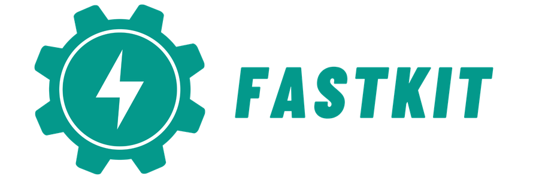
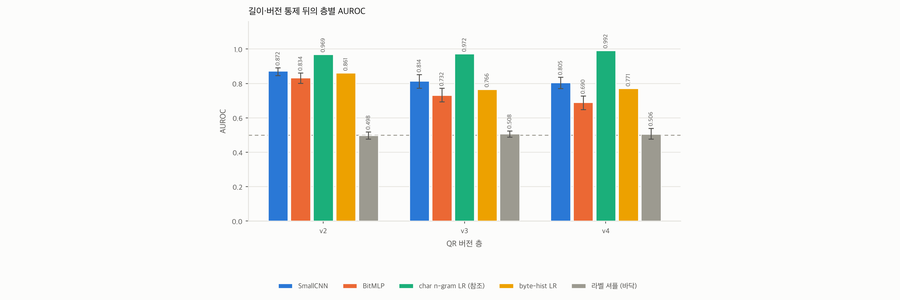
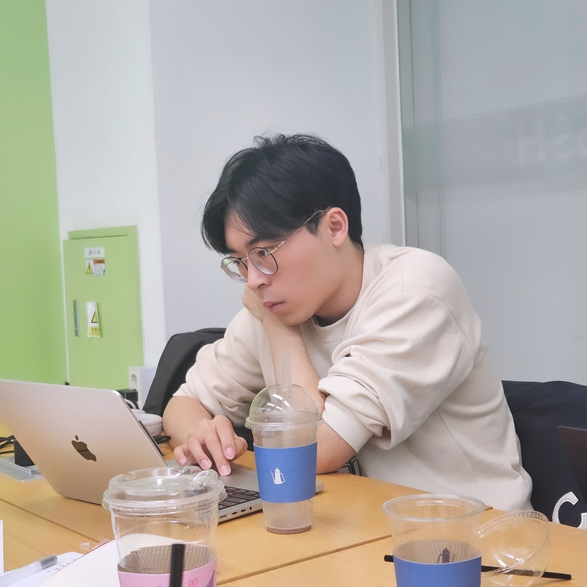

<!-- Header Content -->

<!-- About Me in one line + my contents. -->

  

<h2 align="center">About Me</h2>

Cloud &middot; DevOps &middot; Backend Developer &mdash; <b>삶을 윤택하게 만드는 개발자</b>

- 문제를 작은 나무인 기능 단위가 아닌 큰 숲인 전체 흐름 단위로 해결하는 개발자.
- 관심 분야: **Backend**, **DevOps**, **Cloud**, **Game Dev**
- **한양대학교 ERICA**, 컴퓨터공학부 (2026.08 졸업)
- **SSAFY** (삼성 청년 SW&middot;AI 아카데미) 16기, 데이터 트랙, 대전(2026.07 ~)
- 이전 경력: **Kakao Enterprise** IaaS 기술 기획 인턴 (2024.07~08) · **K-Buddy** 백엔드 & DevOps (2023~2024) · **GiftMusic** 백엔드 (2020~2021)
- **대한민국 공군** 825기 정보체계관리병 병장 만기전역 (2021.04 ~ 2023.01)
- More About Me → **[bnbong.com](https://bnbong.com/)**

  
  
  
  
  

---

<!-- Featured Projects -->
<h2 align="center">Featured Projects</h2>

<table>
  <tr>
    <td width="50%" align="center">
      
       
      FastAPI 프로젝트 초기 구성을 CLI와 템플릿으로 자동화한 오픈소스 패키지 (PyPI)
    </td>
    <td width="50%" align="center">
      
       
      멀티모달 AI 기반 QR/URL 브라우저 보호형 피싱 탐지 확장 프로그램 서비스
    </td>
  </tr>
  <tr>
    <td width="50%" align="center">
      
       
      QR 모듈 격자만으로 피싱 URL을 판별할 수 있는지 통제 실험으로 검증하고 논문화 중인 연구
    </td>
    <td width="50%" align="center">
      
       
      재봉틀 노루발로 원단 위 재봉선을 박는 웹 타임어택 게임 (Godot + FastAPI 리더보드 서버)
    </td>
  </tr>
  <tr>
    <td width="50%" align="center">
      
       
      개인 클라우드 플랫폼으로 운영중인 멀티 저장소 인프라 프로젝트 (FastAPI · Terraform · OCI)
    </td>
    <td width="50%" align="center">
      
       
      GitHub 프로필 README용 개발 역량 요약 SVG 카드 생성기 (아래 Stats 섹션의 카드가 바로 이것)
    </td>
  </tr>
</table>

---

<!-- My Stacks -->
<h2 align="center">Tech Stack</h2>

  <b>Languages</b> 
  

  <b>Backend</b> 
  

  <b>Data</b> 
  

  <b>Infra &amp; Observability</b> 
  

  <b>Etc</b> 
  

REST &middot; WebSocket &middot; SQLAlchemy &middot; MariaDB &middot; Oracle Cloud Infrastructure &middot; EFK / ELK

---

<!-- My Recent Blog Posts -->
<h2 align="center">Blog Posts</h2>

<table>
  <tr>
    <td width="50%" valign="top">
      <h3 align="center"><a href="https://blog.naver.com/bnbong">Daily</a></h3>
      

<!-- DAILY:START -->
 - [26년 8월](https://blog.naver.com/bnbong/224395254240?fromRss=true&trackingCode=rss)

 - [조Love](https://blog.naver.com/bnbong/224385787937?fromRss=true&trackingCode=rss)

 - [26년 7월](https://blog.naver.com/bnbong/224365970384?fromRss=true&trackingCode=rss)

 - [26년 6월](https://blog.naver.com/bnbong/224334227103?fromRss=true&trackingCode=rss)

 - [26년 5월](https://blog.naver.com/bnbong/224301894211?fromRss=true&trackingCode=rss)

 - [26년 4월](https://blog.naver.com/bnbong/224271005370?fromRss=true&trackingCode=rss)

 - [26년 3월](https://blog.naver.com/bnbong/224237404073?fromRss=true&trackingCode=rss)

 - [26년 2월](https://blog.naver.com/bnbong/224206720715?fromRss=true&trackingCode=rss)
<!-- DAILY:END -->

</td>
    <td width="50%" valign="top">
      <h3 align="center"><a href="https://bnbong.com/blog/">Tech</a></h3>
      

<!-- TECH:START -->
 - [[알고리즘 리뷰] 다익스트라](https://bnbong.com/blog/20260913-cs-algorithms-5/)

 - [[알고리즘 리뷰] 이분 탐색 &amp; 이분 탐색 트리](https://bnbong.com/blog/20260902-cs-algorithms-4/)

 - [[알고리즘 리뷰] 정렬](https://bnbong.com/blog/20260830-cs-algorithms-3/)

 - [[Project] Overlock 개발 기록](https://bnbong.com/blog/20260829-overlock/)

 - [[알고리즘 리뷰] DFS / BFS](https://bnbong.com/blog/20260828-cs-algorithms-2/)

 - [[알고리즘 리뷰] 구현](https://bnbong.com/blog/20260825-cs-algorithms-1/)

 - [생소하거나 헷갈리는 Java 문법들](https://bnbong.com/blog/20260627/)

 - [[Computer Network] IPv6](https://bnbong.com/blog/20260526-computer-network-4/)
<!-- TECH:END -->

</td>
  </tr>
</table>

---

<!-- My Programming Stats -->
<h2 align="center">Programming Stats</h2>

  
  

<!-- Github Trophy -->

  

  
  

  

<!---
bnbong/bnbong is a ✨ special ✨ repository because its `README.md` (this file) appears on your GitHub profile.
You can click the Preview link to take a look at your changes.
--->
