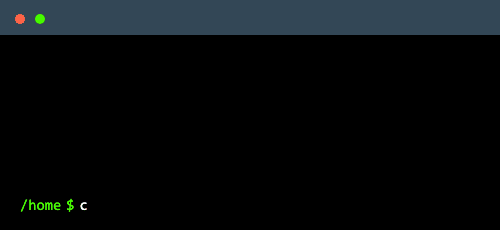

<!-- Header Content -->

<!-- About Me in one line + my contents. -->

  

  <h3 align="center">

  <a href="https://bnbong.xyz">👉 About Me 👈</a>

  </a>
    <a href="https://www.instagram.com/j_hyeok__lee/?hl=ko">
    
    <a href="https://www.facebook.com/profile.php?id=100007712465866">
    
    

<!-- My Stacks -->
  <h2 align="center">💻 My Stacks 💻</h2>
  <h3 align="center">Languages</h3>
  

    
    
    
    
    
    
    
    
    
  

  <h3 align="center">Frameworks & Libraries</h3>
  

    
    
    
    
    
    
    
    
    
    
    
    
  

  <h3 align="center">Databases</h3>
  

    
    
    
    
    
    
    
    
  

  <h3 align="center">DevOps & Infrastructures</h3>
  

    
    
    
    
    
    
    
    
    
    
    
    
    
    
    
    
  

<!-- My Recent Blog Posts -->
<h2 align="center">📝 My Blog Posts 📝</h2>

  

<!-- BLOG-POST-LIST:START -->
 - [24년 1월 두, 세번째 주](https://blog.naver.com/bnbong/223331302809?fromRss=true)

 - [[Github] README.md로 내 프로필 맛있게 꾸미기](https://blog.naver.com/bnbong/223320810097?fromRss=true)

 - [24년 1월 첫번째 주](https://blog.naver.com/bnbong/223315795116?fromRss=true)

 - [23년 12월 마지막 주](https://blog.naver.com/bnbong/223312247805?fromRss=true)

 - [[2023 마이 블로그 리포트] 데이터로 알아보는 블로그 속 숨은 직업 찾기!](https://blog.naver.com/bnbong/223305059583?fromRss=true)

 - [안녕, 2023](https://blog.naver.com/bnbong/223304667984?fromRss=true)

 - [23년 12월 네번째 주](https://blog.naver.com/bnbong/223304473280?fromRss=true)
<!-- BLOG-POST-LIST:END -->

 

<!-- My Programming Stats -->
<h2 align="center">🧑🏻‍💻 Programming Stats 🧑🏻‍💻</h2>

<!-- Github Trophy -->

  

    <a href="https://github.com/ryo-ma/github-profile-trophy">
    
  

  
  

<!---
bnbong/bnbong is a ✨ special ✨ repository because its `README.md` (this file) appears on your GitHub profile.
You can click the Preview link to take a look at your changes.
--->
